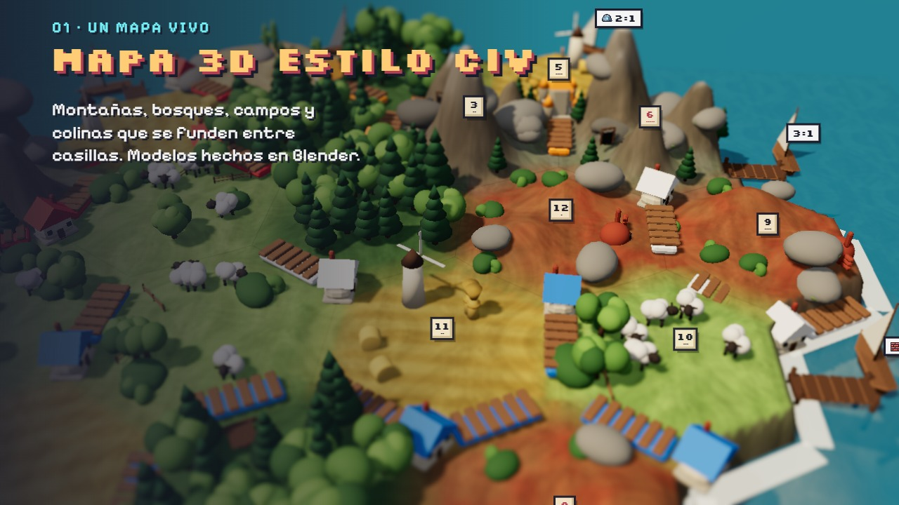

# Catan x Kchudites

Catan en el navegador con mapas personalizables y modos que no existen en la caja.

**Jugar:** https://kurusudes.github.io/CatanTestFriendos/ · **Showcase:** https://kurusudes.github.io/CatanTestFriendos/showcase/ · **Video:** [catan-x-kchudites.mp4](showcase/catan-x-kchudites.mp4)



## Qué trae
- **10 formas de mapa** (clásico, mini, extendido 5-6, grande, gigante, anillo del lago, estrella, dos reinos, archipiélago, pangea aleatoria) + **editor de mapas** con códigos para compartir.
- **Modos insignia:** *Blindfold* (tablero boca abajo durante la colocación; al terminar se voltea todo) y *Niebla de guerra* (visión propia: alrededor de tus casas y medio hexágono junto a tus caminos; si construyes sobre alguien oculto, te desvías al hueco libre más cercano).
- **Más modos combinables:** Casas secretas, Números secretos, Eventos por ronda, Tierra viva, Dados equilibrados, Ladrón amable, Sin ladrón, Ciudad inicial, Turbo.
- **Reglas ajustables:** puntos para ganar, límite de mano, rondas de colocación, bonus inicial, piezas por jugador, mazos de desarrollo, oro, puertos, desiertos.
- **Bots** en 3 niveles, **hotseat** con pantalla de pase, **online** P2P (WebRTC/PeerJS, sin servidor) y **mapa 3D estilo Civilization VI** (three.js: terreno continuo, modelos hechos en Blender en `tools/blender/`, tilt-shift) con **UI pixel art**.
- Reglas completas: ladrón, descartes, puertos 3:1 y 2:1, comercio entre jugadores, cartas de desarrollo, camino más largo y ejército más grande.

## Desarrollo
Sitio estático sin build. Para probar en local:

```bash
python -m http.server 8123
```

Tests del motor (reglas + cientos de partidas bot contra bot con verificación de invariantes):

```bash
npm test
```
