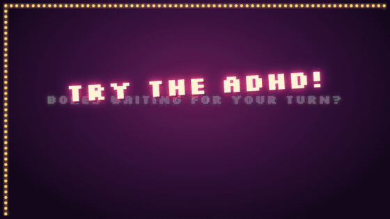
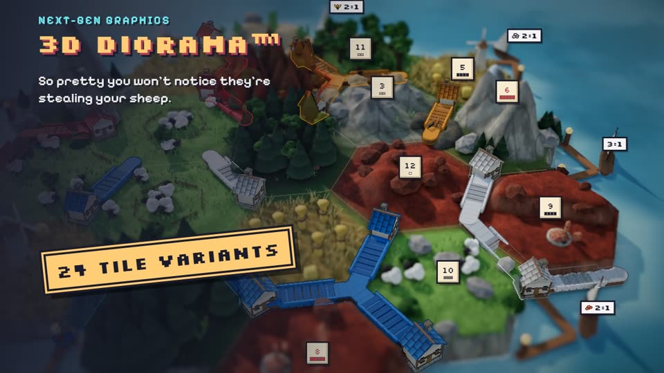
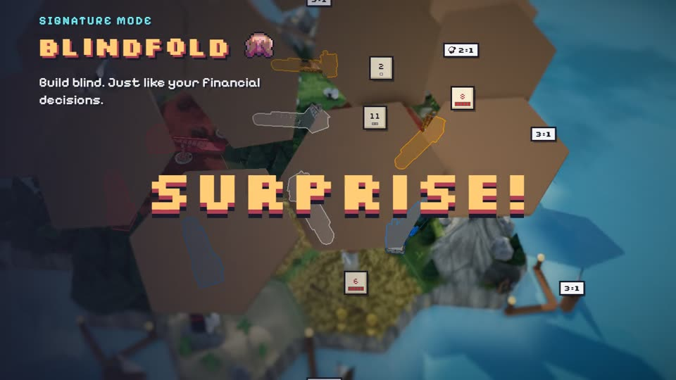
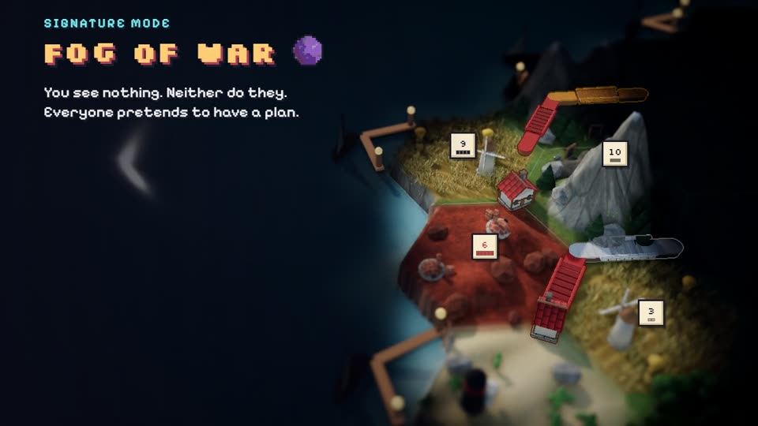
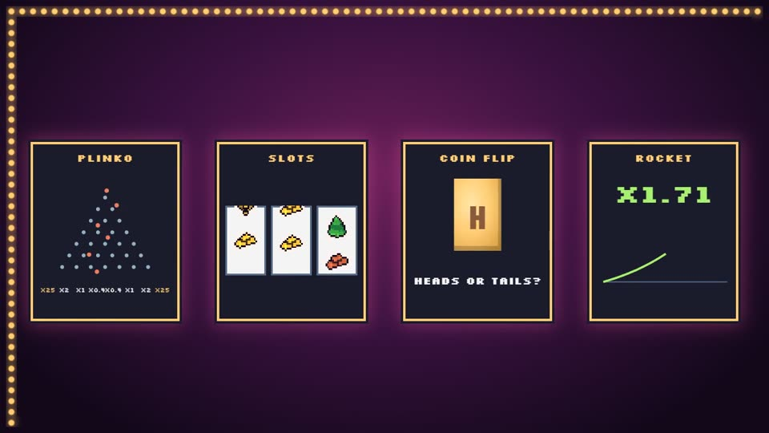
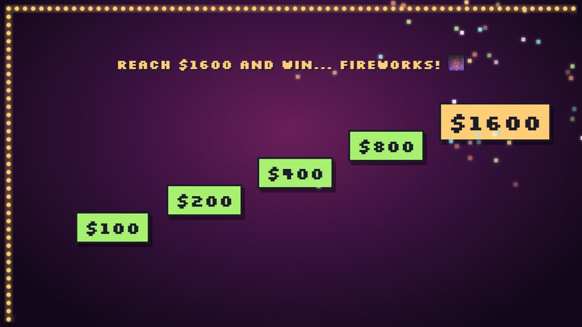
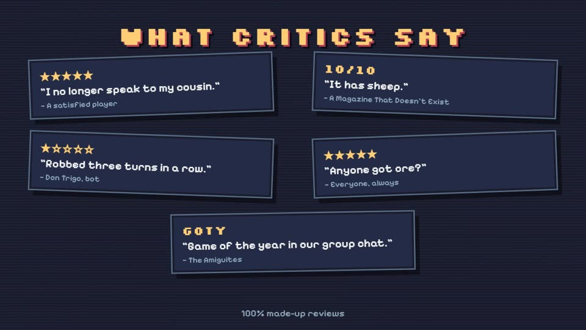
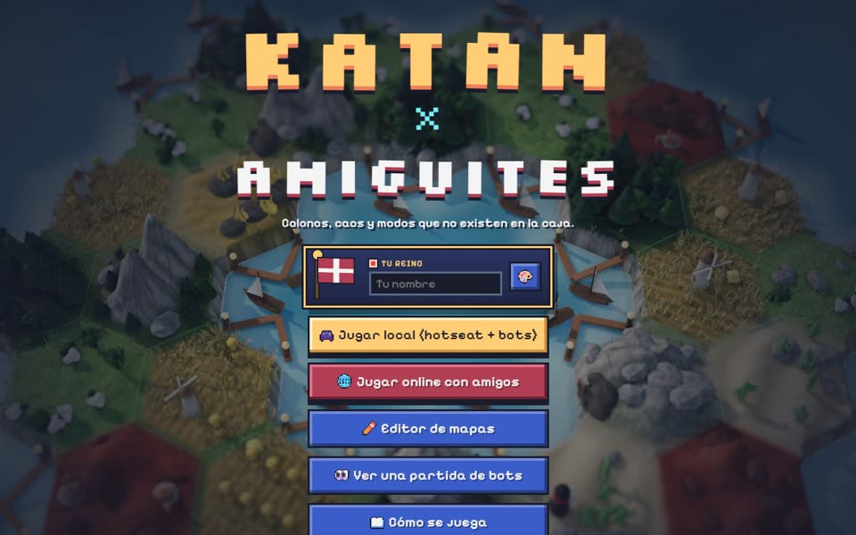
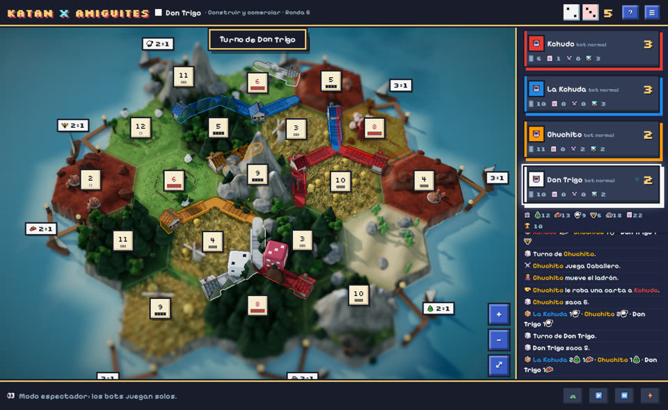

# Katan x Amiguites

*English · [Español](README.es.md)*

**A settlers-style board game inspired by Catan that runs in your browser.** Custom maps, game modes the box never had, bots that hate you, online play with friends, a hand-built 3D diorama board with a pixel-art UI, and a gambling-minigame arcade to kill time while everyone else takes their turn (with 100% fake money).

Free, no ads, no accounts, nothing to install. Works on desktop and mobile.

| | |
|---|---|
| 🎮 **Play** | https://kurusudes.github.io/CatanTestFriendos/ |
| 🎞️ **Trailer (English)** | [Watch in the browser](https://kurusudes.github.io/CatanTestFriendos/showcase/trailer.html?lang=en) · [MP4](showcase/katan-x-amiguites-trailer-en.mp4) |
| 🎞️ **Tráiler (español)** | [Ver en el navegador](https://kurusudes.github.io/CatanTestFriendos/showcase/trailer.html) · [MP4](showcase/katan-x-amiguites-trailer.mp4) |
| 🎬 **Feature showcase** | [Watch in the browser](https://kurusudes.github.io/CatanTestFriendos/showcase/) · [MP4](showcase/katan-x-amiguites.mp4) |

[](https://kurusudes.github.io/CatanTestFriendos/showcase/trailer.html?lang=en)

> The in-game interface is in Spanish. The trailer is available in English and Spanish.

---

## The trailer

A 70-second satirical motion-graphics trailer: an epic movie-trailer cold open ("In a world... where your friends steal your sheep..."), a tour of the modes, fake critic reviews and, as the centerpiece, a parody casino ad for the in-game arcade.



| | | |
|---|---|---|
|  |  |  |
|  |  |  |

Like the showcase, the trailer is a live web page: every frame is a pure function of the clock, including the real 3D board and real bot games, so the same page plays in the browser or is recorded frame by frame into the MP4. The chiptune soundtrack and sound effects are synthesized in code and timed to the scenes.

---

## Screenshots

| Main menu | A game in progress |
|---|---|
|  |  |

---

## Features

### Maps
- **10 map shapes:** classic (19 hexes), mini (14), extended for 5–6 players (30), big (37), huge (61), lake ring, star, two kingdoms, archipelago and random pangea.
- **Map editor** with shareable map codes.
- Balanced or chaotic resource and number placement, optional **gold** tiles, configurable ports and deserts.

### Signature modes
- **Blindfold:** the whole board starts face down. You place your first settlements blind (everyone else can see where they went) and when setup ends the board flips over.
- **Fog of war:** everyone has their own vision, around their buildings plus half a hex beside their roads. Build onto someone you can't see and your piece is diverted to the nearest free spot.

### More modes (all combinable)
- **Secret houses:** nobody sees where the others place their first houses until the reveal; on a clash, the latecomer relocates.
- **Secret numbers:** you see the resources, but number tokens reveal themselves when someone builds next to them.
- **Round events:** each round draws an event: bumper harvest, drought, fair trade, black market, earthquake, storm, the king's gift, plague, taxes, rebellion or calm.
- **Living land:** every 3 rounds the numbers (or the resources) on the map shuffle.
- **Balanced dice:** rolls come from a 36-card deck, so the statistics hold.
- **Friendly robber**, **no robber**, **starting city** and **turbo** (double production).
- **Presets** that bundle them: Classic, Blindfold, Fog of war, Explorers, Paranoia, Total chaos, Quick and War.

### Rules you can tune
Victory points, hand limit, setup rounds, starting bonus, pieces per player, development card decks (normal, war, progress or none), gold, ports and deserts. The full base rules are in: robber, discards, 3:1 and 2:1 ports, player trading, development cards, longest road and largest army.

### Players
- **Up to 8 players**, with the bank, deck and maps scaled to match.
- Every kingdom paints its own **flag** in a 12×12 pixel editor and picks a **castle color**; the flag waves on the 3D board.
- **Bots** in three levels (easy, normal, hard) that trade, rob and block. There's also a 💡 hint button that suggests a move.
- **Hotseat** on one device, with a pass-the-screen privacy step between human players.
- **Spectator mode:** watch a bots-only game at the speed you pick.

### Online with friends
- **Peer-to-peer** over WebRTC (PeerJS). The host's browser runs the game; there's no game server. Share a short room code or a link.
- **Automatic reconnection:** drop out and you get your seat back.
- When someone disconnects, the table **votes**: wait, let a bot take over, or retire the player.
- If the host drops, they can **reopen the room** with the same code and carry on.
- **Reactions:** emoji balloons rise from all of your buildings, and a middle click drops a marker on the map that everyone sees.

### The ADHD arcade
A small window of gambling minigames for while you wait for your turn, with **fake money**:
- **Plinko**, **slots**, **coin flip** and **rocket** (cash out before it blows up; it can reach x10, but almost never does, and after you cash out a ghost rocket shows how far it would have gone), unlocked one after another as your balance grows ($200, $400, $800).
- Machines you've already beaten get an **Auto** button.
- Reach **$1600** and fireworks burst from your houses, with a banner every player sees (winners who land together get their banners one after another).
- Every win of the match adds **gold trims** to your pieces, up to 5: beams, road edges and studs, windows, a gold knob on the roof and finally a shine.
- It **minimizes itself when it's your turn** and stays behind trade offers, so it never gets in the way of the game.

### Board and interface
- **3D diorama board** built with three.js: one continuous terrain blending 8 PBR textures, a physical sky with image-based lighting, water with depth-based foam, grass and wheat swaying in the wind, cloud shadows, ambient occlusion and a tilt-shift camera.
- **Tile variants:** every resource has several looks (pine hill, woodcutter's clearing, round sheep pen, mill on a knoll, clay pit, brickworks, snowy peak, quarry...), picked per tile so every player sees the same map.
- Props and resource icons are modelled in **Blender** and generated by scripts in `tools/blender/` (icons are 3D models rendered through a pixel camera).
- **Top view** button: the camera goes straight down onto the map, like a flat plan. Number tokens and port signs shrink as you zoom out, so they never cover the tiles.
- A **dice history** in the top right corner of the map: the last rolls, newest first, in the colour of whoever threw them.
- **Pixel-art UI** with animated dice you can charge (hold the button to throw harder), **cards that fly** from the tiles to your hand, between players when trading and to and from the bank, and a sound effects set synthesized in the browser.

---

## Tech

- **A static site with no build step:** plain JavaScript ES modules, HTML and CSS. It's served straight from GitHub Pages.
- **Rules engine** (`js/engine/`): pure functions. `applyAction(state, action)` validates and applies every move, and visual effects come out as a list of events, so the same engine drives local games, online games (on the host) and the tests.
- **Libraries:** [three.js](https://threejs.org/) for the 3D board and [PeerJS](https://peerjs.com/) for WebRTC. Both load from a CDN.

| Area | Files | What it does |
|---|---|---|
| Rules engine | `js/engine/game.js`, `board.js`, `constants.js`, `config.js`, `rng.js` | Game state, rules, map generation, seeded randomness |
| Bots | `js/engine/bot.js` | Three difficulty levels, plus the hint button |
| App | `js/app.js`, `js/main.js` | Game state, dispatching actions, bot turns, saving |
| Online | `js/net.js` | Rooms, host-authoritative sync, reconnection, voting |
| Game screen | `js/ui/gameView.js` | Cards, hand, actions, dice, trading, flying cards |
| 3D board | `js/ui/board3d.js`, `dice3d.js`, `flag.js` | Terrain, tile variants, pieces, fog, 3D dice, flags |
| ADHD arcade | `js/ui/adhd.js` | The four minigames, balance, unlocks, fireworks |
| Other UI | `js/ui/lobby.js`, `editor.js`, `pixel.js`, `sfx.js`, `help.js` | Lobby and rooms, map editor, pixel sprites, sounds, help |
| Styles | `css/style.css`, `css/pixel.css` | Pixel theme (Sweetie-16 palette) |
| Assets | `assets/`, `tools/blender/` | Textures, `kit.glb` models and icons, and the Blender scripts that make them |
| Videos | `showcase/` | Showcase and trailer pages (`trailer.html?lang=en`), shared animation helpers in `motion.js` |
| Tests | `tests/` | Rules tests plus hundreds of bot-vs-bot games with invariant checks |

## Running it locally

```bash
python -m http.server 8123
# then open http://localhost:8123/
```

Engine tests (rules plus 300 bot-vs-bot games checking invariants):

```bash
npm test
```

## License and credits

Original code and assets are under the [MIT license](LICENSE) © 2026 Sowtank. If you use this project or part of it, a visible credit is kindly appreciated (details in [NOTICE.md](NOTICE.md)).

**Unofficial fan project.** It isn't affiliated with, sponsored or endorsed by Catan GmbH, CATAN Studio or Kosmos. *CATAN* is a trademark of its respective owners. Third-party notices (three.js, PeerJS, fonts) are in [NOTICE.md](NOTICE.md).
